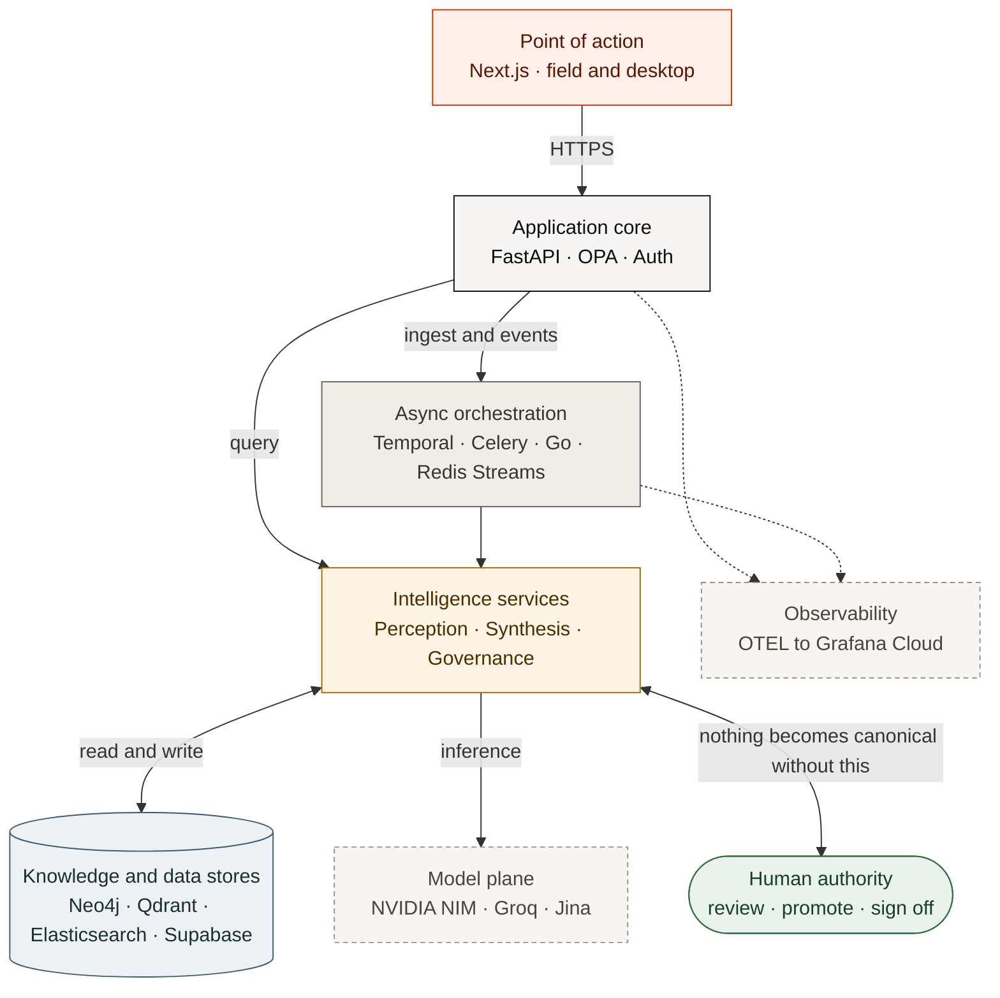
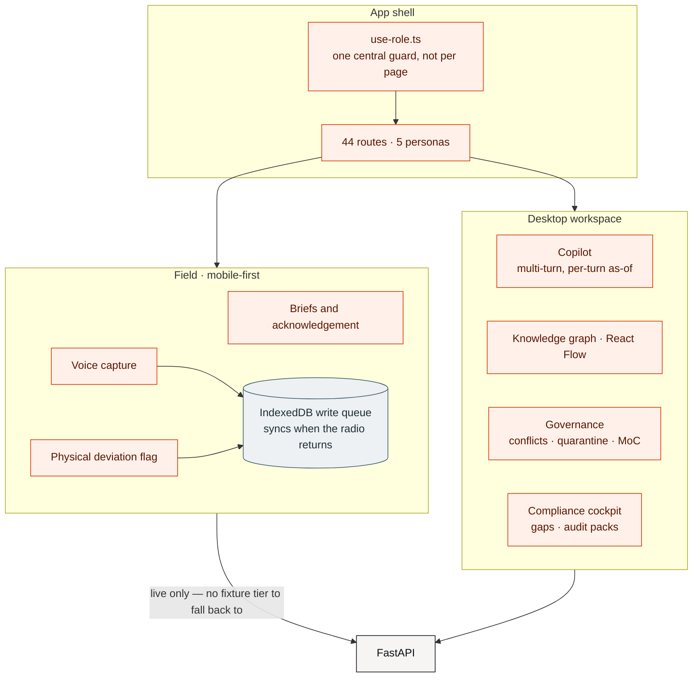
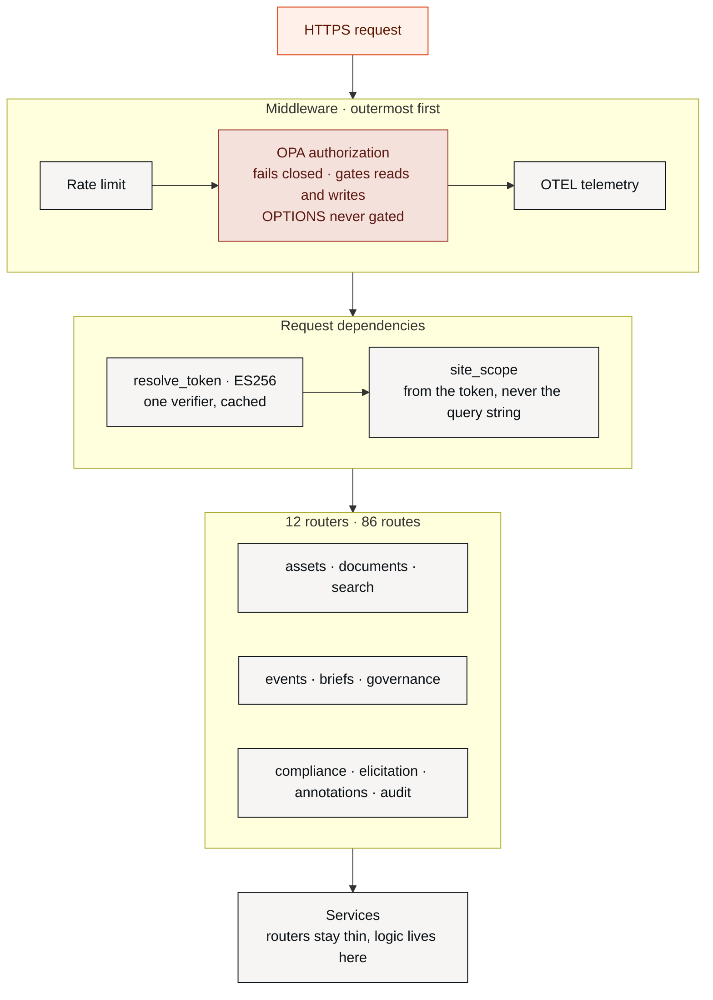
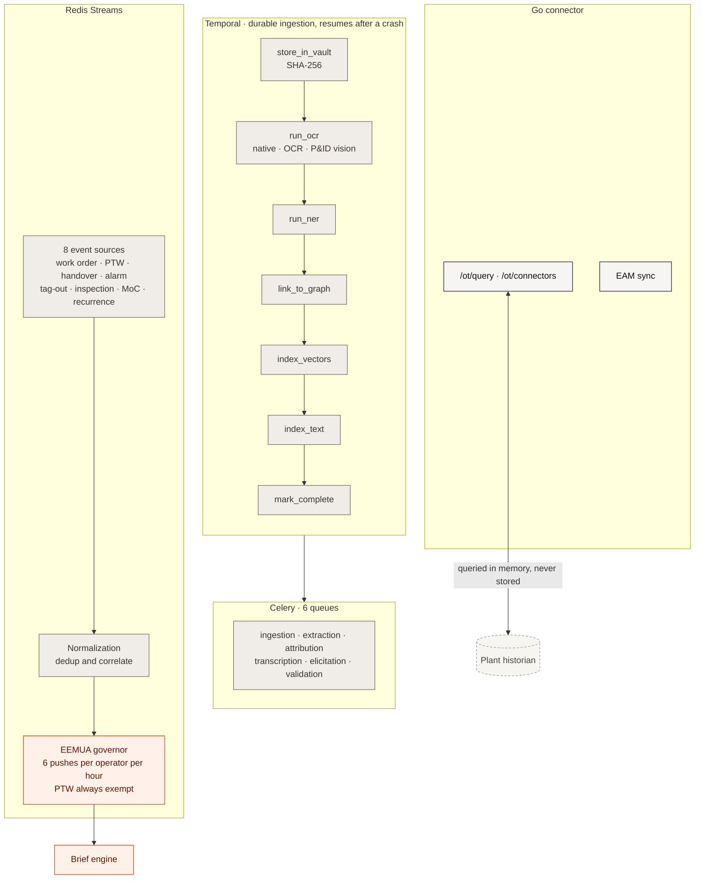
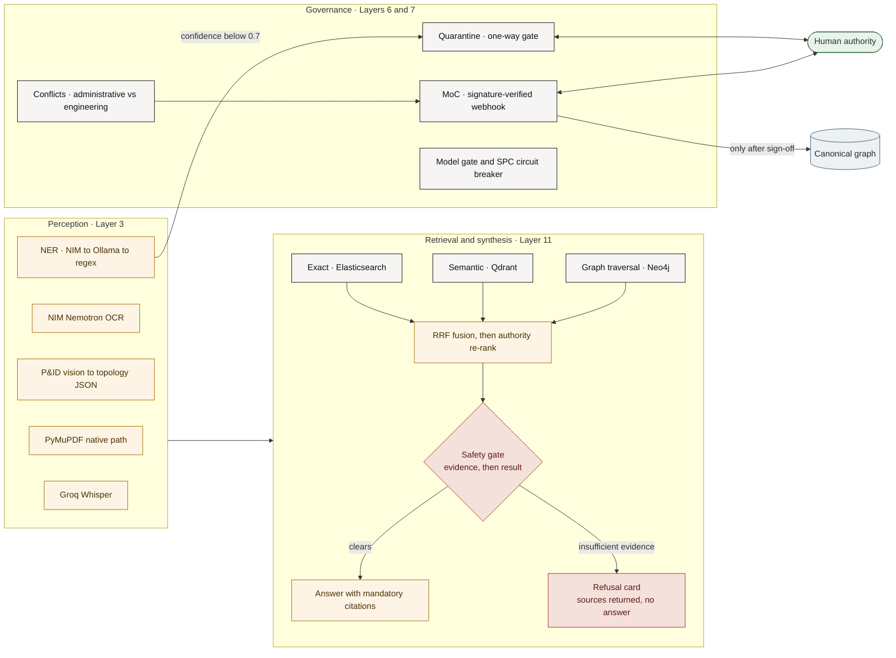
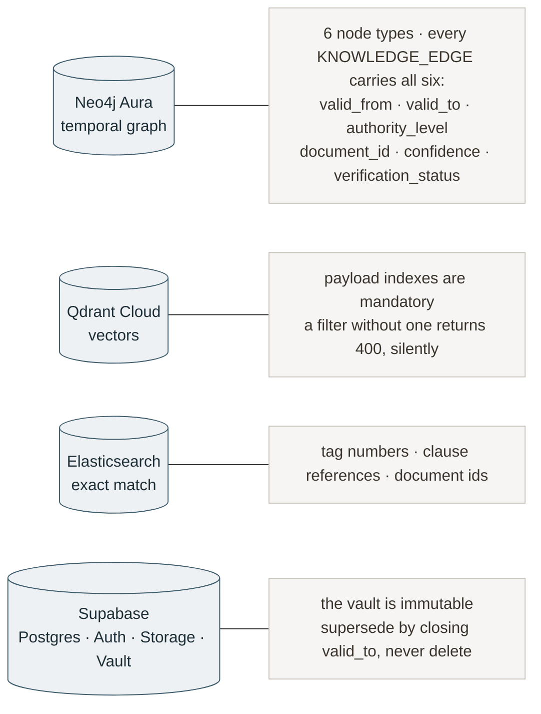
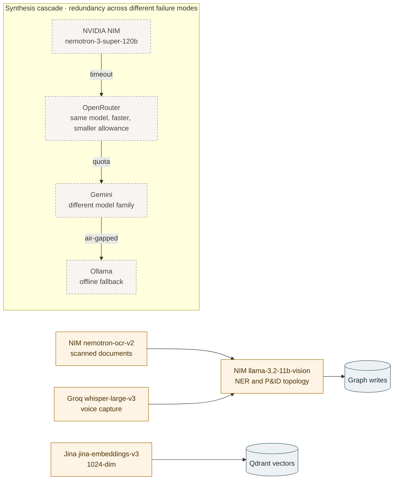

# Kairos — System design diagrams

Mermaid sources for the landing page **System design** section (`frontend/src/app/page.tsx`,
`systemDesign[]`). One overview plus one drill-down per tab; each heading here is the tab `id`.

The overview carries **block names only** — every box in it has its own diagram below, which is what
the tabs switch between. Keep that split: the moment the overview starts naming services it stops
being readable at panel size and duplicates a drill-down that says it better.

---

## Naming

Two of the inherited tab labels are generic where the architecture already has a better word:

| Tab label now | Use instead | Why |
|---|---|---|
| Presentation | **Point of action** | `ARCHITECTURE.md` Layer 12 is *"Phased Deployment, Trust Architecture, and Point-of-Action Interface"*. "Presentation" is a generic n-tier term that could head any system's diagram; "point of action" is the product's actual thesis — knowledge delivered where work happens, not a search box. |
| External model APIs | **Model plane** | The architecture's own phrase is *"cloud-only model plane"*. It also stops reading like a vendor list once the synthesis cascade is in the box. |

The other four (*Application core · Async orchestration · Intelligence services · Knowledge and data
stores*) are accurate and stay. Diagrams below use the recommended names; if you keep the current tab
labels, change the two subgraph titles to match — the tab and the diagram must not disagree.

---

## Palette

Built from the landing page's own tokens, not invented. `--lp-bg`/`--lp-surface` `#ffffff`,
`--lp-ink` `#0b1015`, `--lp-line` `#e5e3df`, accent `#ff3c00` / `#d93400` / `#cc3100`.

The landing page is **deliberately single-theme light** — `--lp-bg` is defined once and never
redefined under `[data-theme="dark"]` — so these are tuned for a white ground only. If that ever
changes, the fills need a dark set.

Colour carries meaning rather than decoration, and it is the same meaning on every tab:

| Class | Role | Fill / stroke |
|---|---|---|
| `edge` | Where a human touches the system | `#fff1ea` / `#d93400` — accent family |
| `core` | Request path | `#f6f5f3` / `#0b1015` |
| `work` | Async and background | `#f0ede8` / `#6b6259` |
| `think` | Model-backed reasoning | `#fdf4e6` / `#a66a00` |
| `store` | Persistent state | `#edf1f4` / `#3e5c6b` — the one cool hue, so storage separates at a glance |
| `ext` | Outside Kairos | `#f7f5f2` / `#9a9086`, dashed |
| `human` | Human authority gate | `#e9f2ec` / `#2f6b3e` |
| `stop` | Refusal / hard gate | `#f5e1dc` / `#9a3324` |

Green and brick appear **only** on the human gate and the refusal path. That is the point: the two
places the system declines to act on its own are the two places the eye should land.

---

## `overview` — the complete architecture



---

## `client` — Point of action



---

## `core` — Application core



---

## `orch` — Async orchestration



`direction TB` inside `TMP` is load-bearing. Without it, dagre runs the seven-step chain across the
parent's axis and the diagram renders 2400px wide instead of 1205px.

The seven pipeline steps stay as seven boxes. Merging them makes the diagram shorter, but it hides
the fact that each one is a separate durable activity that can fail and resume on its own, so the
height is worth paying for.

Keep notes like this one out here in prose, not as `%%` comments inside the block. A bare `%%` line
renders as a stray node in the diagram.

---

## `svc` — Intelligence services



---

## `data` — Knowledge and data stores



---

## `ext` — Model plane



---

## Rendering

These are rendered ahead of time to static SVG in `frontend/public/diagrams/` and served as plain
``. The landing page carries **no** runtime mermaid dependency: seven fixed pictures that only
change when this file changes do not justify shipping a renderer to every visitor.

```bash
npx @mermaid-js/mermaid-cli mmdc -i <id>.mmd -o frontend/public/diagrams/<id>.svg -c mermaid.config.json -b white
```

`-b white` matters. Without it mermaid-cli emits a transparent SVG, and the `base` theme's own
defaults for the parts `classDef` does not reach — cluster fills, edge labels, arrowheads — are
resolved against the wrong ground. `mermaid.config.json` at the repo root holds the theme
variables; it exists so a re-render reproduces these files rather than approximating them.

**Direction is per diagram, and it is a legibility decision, not a style one.** These sit in the
left-hand panel of a two-column section, roughly 620 px of drawable width, and the image is scaled
to fit it — so the narrower a diagram renders, the larger its 14 px labels survive. Pick whichever
direction gives the smaller **width**, which is not the same as the better-looking shape:

| id | `TB` | `LR` | used |
|---|---|---|---|
| `overview` | 736 | 1711 | TB |
| `client` | 981 | 2046 | TB |
| `core` | 777 | 2125 | TB |
| `orch` | 2400 → **1205** | 1487 | TB + inner `direction` |
| `svc` | 2513 | 1587 | LR |
| `data` | 1160 | 541 | LR |
| `ext` | 1959 | 823 | LR |

Diagrams holding three or four parallel groups (`orch`, `svc`, `ext`) get laid out side by side by
`TB` and blow past 2000 px; `LR` stacks those groups instead.

`orch` is the exception and worth knowing about: an explicit `direction` **inside** a subgraph
overrides how dagre runs that subgraph's own chain, independently of the parent. Pinning the
seven-step Temporal chain to `TB` inside a `TB` parent takes the diagram from 2400 px to 1205 px
without touching a node, an edge or a label. It does not generalise — the same change applied to
`svc` makes it *worse* (1587 → 2298), so measure rather than assume.

If you add a group to a diagram, re-render and check the `viewBox` before committing it.

---

## Keeping these honest

Each drill-down states a real constraint rather than only naming components — the refusal branch in
`svc`, the fail-closed OPA in `core`, the mandatory payload index in `data`, the offline write queue
in `client`. A diagram that only lists boxes is indistinguishable from any other system's; the
constraints are what make this one specific.

Update these when the corresponding layer changes in `ARCHITECTURE.md`. The README's diagram is a
single detailed view of the same system; these are its panel-sized split.

**Two claims were corrected in the README diagram on 2026-08-22** and must not come back: it said
*"Next.js on Vercel"* (there is no Vercel config anywhere — the frontend builds as a Docker image,
and deployment is out of scope) and *"FastAPI behind Caddy (HTTPS)"* (Caddy is `profiles: ["prod"]`
and is not among the 12 default services, so nothing is behind it in the delivered stack).
